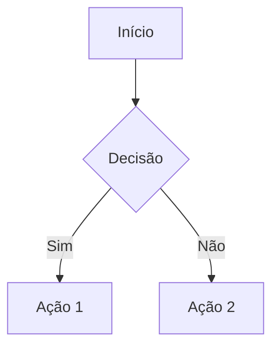

<div align="center">

</div>

# StaticMD — Markdown to Mobile HTML Compiler

Compilador Markdown de alta performance que gera páginas HTML standalone, otimizadas para mobile, com suporte a diagramas Mermaid e múltiplos temas visuais.

## Funcionalidades

- **Edição em tempo real** com preview lado a lado
- **3 temas visuais**: Modern Clean, Reader Sepia e Caderno Pautado (Notebook)
- **Diagramas Mermaid** renderizados automaticamente (flowchart, sequence, gantt, etc.)
- **Sumário automático (TOC)** gerado a partir de headings `##` e `###`
- **Exportação HTML** completa e autossuficiente (single-file)
- **Impressão/PDF** via `Ctrl+P` com layout otimizado
- **Header e Footer** configuráveis com posicionamento fixo (sticky) ou em fluxo
- **Persistência local** — rascunhos salvos automaticamente no navegador
- **Fontes tipográficas**: Inter, Lora e JetBrains Mono

## Executar Localmente

**Pré-requisitos:** Node.js

```bash
npm install
npm run dev
```

---

## Guia de Estrutura para Editores

Para garantir documentos profissionais e consistentes, siga esta estrutura padrão ao redigir conteúdo no StaticMD.

### 1. Identidade e Metadados (Cabeçalho / Header)

Use o campo **Header** na barra lateral para informações institucionais. Estrutura recomendada:

```markdown
### Nome da Instituição
**Responsável:** Nome Completo | **Data:** DD/MM/AAAA
---
```

> **Dica:** Ative o modo **"Fixo" (Sticky)** no cabeçalho para que ele se repita no topo ao rolar a página e apareça em todas as páginas na impressão PDF.

### 2. Corpo do Documento (Editor Principal)

#### Título Principal (H1)

Use **apenas um** `# Título` no início do documento. Ele será utilizado como nome do arquivo no download.

```markdown
# Relatório de Atividades Q1 2026
```

#### Seções (H2) e Subseções (H3)

O **Sumário (TOC)** é gerado automaticamente a partir das tags `##` e `###`. Estruture o conteúdo de forma hierárquica:

```markdown
## Introdução
Texto da seção...

### Contexto
Texto da subseção...

## Metodologia
Texto da seção...
```

#### Gráficos e Diagramas

Utilize blocos de código **mermaid** para representar processos, fluxos e cronogramas:

````markdown

````

Tipos suportados: `graph TD`, `sequenceDiagram`, `gantt`, `classDiagram`, `pie`, entre outros.

#### Imagens

Como a aplicação opera via link, use o padrão Markdown:

```markdown

```

#### Tabelas

Sempre inclua a linha de alinhamento entre o cabeçalho e o corpo da tabela:

```markdown
| Coluna A | Coluna B | Coluna C |
| :------- | :------- | :------- |
| Dado 1   | Dado 2   | Dado 3   |
| Dado 4   | Dado 5   | Dado 6   |
```

### 3. Fechamento (Footer)

Use o campo **Footer** na barra lateral para assinaturas, avisos de confidencialidade ou links de contato:

```markdown
*Documento confidencial — Uso interno*
**Contato:** equipe@empresa.com | (11) 9999-0000
```

> **Dica:** Ative o modo **"Fixo" (Sticky)** no rodapé para que ele apareça em todas as páginas ao imprimir o PDF.

---

### Resumo Visual da Estrutura

```
┌─────────────────────────────────────┐
│  HEADER (Sticky ou Flow)            │
│  Instituição · Responsável · Data   │
├─────────────────────────────────────┤
│                                     │
│  # Título Principal (H1)           │
│                                     │
│  ## Seção (H2) ← aparece no TOC    │
│  Parágrafos, listas, imagens...     │
│                                     │
│  ### Subseção (H3) ← aparece no TOC│
│  Tabelas, diagramas mermaid...      │
│                                     │
│  ## Outra Seção (H2)               │
│  Conteúdo...                        │
│                                     │
├─────────────────────────────────────┤
│  FOOTER (Sticky ou Flow)            │
│  Assinatura · Confidencialidade     │
└─────────────────────────────────────┘
```
