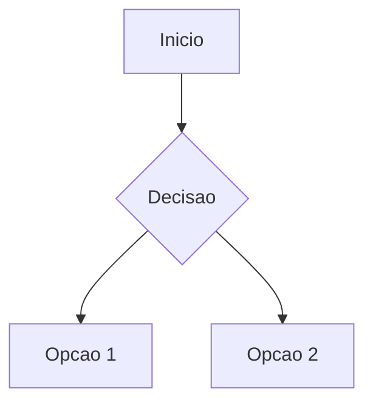

<div align="center">


# StaticMD - Markdown to HTML/PDF Compiler

Compilador Markdown em tempo real com temas visuais, diagramas Mermaid, exportacao para HTML standalone e impressao/PDF.

**Stack:** React 19 | TypeScript | Vite | Tailwind CSS | MarkdownIt | Mermaid 11

</div>

---

## Visao Geral

O StaticMD e um editor Markdown com preview ao vivo que compila documentos para HTML autonomo ou PDF. Ideal para professores, estudantes e profissionais que precisam gerar material didatico formatado rapidamente.

### Principais Funcionalidades

| Funcionalidade | Descricao |
|:--------------|:----------|
| **Editor Markdown** | Textarea com toolbar de formatacao (bold, italic, links, tabelas, imagens, diagramas) |
| **Preview ao Vivo** | Renderizacao em tempo real com estilos aplicados |
| **3 Temas Visuais** | Modern Clean, Reader Sepia e Caderno Pautado (Notebook) |
| **Diagramas Mermaid** | Suporte completo a flowcharts, grafos, sequencias, etc. |
| **Cabecalho/Rodape** | Markdown customizavel com modo Normal ou Fixo (sticky) |
| **Sumario Interativo** | Painel de outline com navegacao por headings (H1-H3) |
| **Exportar HTML** | Gera arquivo HTML standalone com todos os estilos embutidos |
| **Imprimir/PDF** | Exportacao via impressao nativa do navegador |
| **Templates** | Modelos prontos para aulas, relatorios e documentos em branco |
| **Auto-save** | Salvamento automatico no localStorage a cada 1 segundo |

---

## Rotas e Estrutura do Projeto

O projeto e uma SPA (Single Page Application) servida pelo Vite. Nao ha rotas de navegacao — toda a interface roda em uma unica pagina.

### Estrutura de Arquivos

```
mkd-pdf-html/
├── App.tsx                      # Componente principal (state management, layout)
├── index.tsx                    # Entry point React
├── index.html                   # Template HTML (fonts, Tailwind CDN, meta tags)
├── types.ts                     # Tipos TypeScript (ThemeId, FontId, Template, etc.)
├── templates.json               # Modelos pre-definidos de documentos
├── vite.config.ts               # Configuracao Vite (porta 3000, host 0.0.0.0)
├── tsconfig.json                # Configuracao TypeScript
├── package.json                 # Dependencias e scripts
│
├── components/
│   ├── Editor.tsx               # Editor Markdown com toolbar de formatacao
│   ├── Preview.tsx              # Preview ao vivo com Mermaid e outline
│   ├── ThemeSelector.tsx        # Seletor de temas visuais
│   └── DocumentSettings.tsx     # Config: fonte, tamanho, templates, header/footer, sumario
│
├── services/
│   └── compiler.ts              # Compilador Markdown → HTML standalone
│
└── dist/                        # Build de producao (gerado por `npm run build`)
```

### Fluxo de Dados

```
[Editor.tsx]  →  markdown (string)  →  [App.tsx]  →  [Preview.tsx]
                                            │              ↓
                                            │       Renderizacao ao vivo
                                            │       (MarkdownIt + Mermaid)
                                            │
                                            └──→  [compiler.ts]
                                                       ↓
                                                  HTML standalone
                                                  (download / print)
```

---

## Temas Disponiveis

| Tema | ID | Background | Texto | Destaque |
|:-----|:---|:-----------|:------|:---------|
| **Modern Clean** | `MODERN` | Branco (`#ffffff`) | Cinza escuro | Azul (`#2563eb`) |
| **Reader Sepia** | `SEPIA` | Creme (`#f4ecd8`) | Marrom (`#433422`) | Marrom (`#8b5e3c`) |
| **Caderno Pautado** | `NOTEBOOK` | Amarelado (`#fdfdf7`) | Slate | Rose (`#f43f5e`) |

O tema **Caderno Pautado** inclui linhas pautadas horizontais (grid 1.5rem) e linhas vermelhas de margem (48-50px), visiveis tanto no preview quanto no PDF exportado.

---

## Templates

O arquivo `templates.json` contem modelos pre-configurados:

| Template | ID | Descricao |
|:---------|:---|:----------|
| **Bioquimica** | `bioq` | Aula completa com tabelas e diagramas Mermaid |
| **Relatorio Corporativo** | `corp` | Relatorio executivo com header/footer profissional |
| **Em Branco** | `blank` | Documento vazio para comecar do zero |

---

## Guia para Editores (Usuarios do Live)

### Iniciando

1. Ao abrir o projeto, voce vera o **Editor** na esquerda e o **Preview** na direita
2. O conteudo de exemplo ja vem carregado — edite livremente
3. Tudo e salvo automaticamente no navegador (localStorage)

### Escrevendo Markdown

Use a **toolbar** acima do editor para inserir formatacao rapidamente:

| Botao | Acao | Sintaxe |
|:------|:-----|:--------|
| **B** | Negrito | `**texto**` |
| *I* | Italico | `_texto_` |
| Link | Inserir link | `[texto](url)` |
| Lista | Bullet point | `- item` |
| Tabela | Tabela markdown | Template de tabela |
| Diagrama | Mermaid chart | Bloco de codigo mermaid |
| Imagem | Inserir imagem | `` |

### Inserindo Diagramas Mermaid

Crie diagramas dentro de blocos de codigo com a linguagem `mermaid`:

````markdown

````

> **Nota:** Nao use formatacao markdown (como `**bold**`) dentro dos labels do diagrama. O sistema remove automaticamente, mas e melhor evitar para garantir compatibilidade.

### Configurando o Documento

No painel **Configuracoes** (abaixo do editor):

1. **Fonte** — Escolha entre Sans (Inter), Serif (Lora) ou Mono (JetBrains Mono)
2. **Tamanho** — Ajuste o tamanho da fonte em pixels (padrao: 16)
3. **Modelos** — Selecione um template pre-configurado
4. **Sumario** — Mostrar ou Ocultar o painel de outline no preview
5. **Cabecalho** — Escreva markdown para o topo do documento
   - **Normal**: aparece no inicio do documento
   - **Fixo**: aparece em todas as paginas (ao imprimir)
6. **Rodape** — Mesma logica do cabecalho, para o final

### Escolhendo um Tema

Clique em um dos 3 temas no seletor abaixo do editor:

- **Modern Clean** — Limpo e profissional, ideal para relatorios
- **Reader Sepia** — Tom quente, ideal para leitura prolongada
- **Caderno Pautado** — Estilo caderno com linhas, ideal para aulas e anotacoes

### Usando o Sumario

1. Habilite o sumario em **Configuracoes > Sumario > Mostrar**
2. Clique no botao **Sumario** no canto superior direito do preview
3. O painel lateral mostra todos os titulos (H1, H2, H3) do documento
4. Clique em qualquer titulo para navegar ate ele

### Exportando o Documento

#### HTML Standalone
1. Clique em **Baixar HTML** (botao azul no header)
2. O arquivo `.html` gerado e autonomo — inclui todos os estilos, fontes e Mermaid
3. Abra em qualquer navegador, sem necessidade de internet

#### PDF via Impressao
1. Clique em **Imprimir / PDF** (botao cinza no header)
2. Na janela de impressao do navegador, selecione **Salvar como PDF**
3. Recomendado: marque **Graficos de fundo** nas opcoes de impressao para manter cores e linhas do tema Notebook

### Importando Arquivos

1. Clique em **Importar .md** no header
2. Selecione um arquivo `.md` ou `.txt` do seu computador
3. O conteudo sera carregado no editor

### Limpando Tudo

1. Clique em **Novo Doc** no header
2. Confirme a acao no dialogo
3. Editor, cabecalho e rodape serao limpos

---

## Rodando o Projeto

### Pre-requisitos

- **Node.js** (v18+)
- **npm** (v9+)

### Instalacao e Desenvolvimento

```bash
# Clonar o repositorio
git clone https://github.com/projetos-ept/mkd-pdf-html.git
cd mkd-pdf-html

# Instalar dependencias
npm install

# Rodar servidor de desenvolvimento (porta 3000)
npm run dev
```

O servidor inicia em `http://localhost:3000` e aceita conexoes de rede (`0.0.0.0`).

### Build de Producao

```bash
# Gerar build otimizado
npm run build

# Pre-visualizar build
npm run preview
```

Os arquivos otimizados sao gerados em `dist/`.

### Scripts Disponiveis

| Script | Comando | Descricao |
|:-------|:--------|:----------|
| `dev` | `npm run dev` | Servidor de desenvolvimento com HMR |
| `build` | `npm run build` | Build de producao otimizado |
| `preview` | `npm run preview` | Pre-visualizar build de producao |

---

## Dependencias Principais

| Pacote | Versao | Uso |
|:-------|:-------|:----|
| `react` | ^19.2.4 | Framework UI |
| `markdown-it` | 14.1.0 | Parser Markdown |
| `mermaid` | 11.4.0 | Renderizacao de diagramas |
| `lucide-react` | 0.460.0 | Icones SVG |

---

## Persistencia de Dados

Todos os dados do editor sao salvos automaticamente no **localStorage** do navegador:

- **Chave:** `staticmd_save_data`
- **Dados salvos:** markdown, cabecalho, rodape, tema, fonte, tamanho, posicoes, sumario
- **Frequencia:** A cada 1 segundo (debounced)
- **Indicador:** Icone de sincronizacao no rodape da aplicacao

> **Atencao:** Limpar os dados do navegador apaga todo o conteudo salvo. Use **Baixar HTML** para manter uma copia permanente.

---

## Licenca

Desenvolvido por **LEDUK** | CETEP/LNAB
